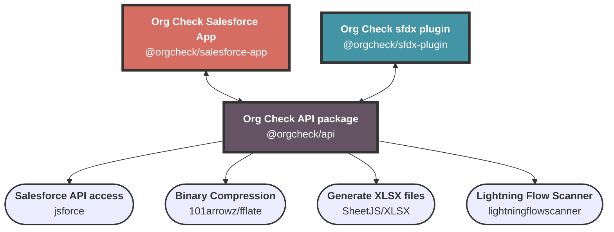

  
  <h1>Org Check: API, Salesforce App and sf plugin</h1>
  

    <b>Org Check</b> is an easy-to-install and easy-to-use <b>Salesforce application</b> and <b>sf plugin</b> in order to quickly analyze your org and its <b>technical debt</b>.
  

  &nbsp;
  &nbsp;
  &nbsp;
  &nbsp;
  &nbsp;
  &nbsp;

---

## The same logic across a Salesforce App and a sf plugin

## Org Check Salesforce App
- The app is available from the AppExchange
- You need to install the app in the org you want to analyze
- The app has a nice UI allowing to see and export the result of the analysis

## Org Check sf plugin
- The plugin is published on npmjs (as any sf plugins)
- You need to install the plugin in your local machine via `sf plugins install @orgcheck/sfdx-plugin`
- From there, you can run analysis on multiple orgs providing you have access to them via the flag `--target-org`in the sf CLI
- JSON, CSV and XLSX output

## More about Org Check:
- [Website](https://SalesforceLabs.github.io/OrgCheck/)
- [LinkedIn](https://www.linkedin.com/company/orgchecksfdc/)
- [AppExchange](https://sfdc.co/OrgCheck-InstallToday-AppExchange)
- [NPMjs](https://www.npmjs.com/package/@orgcheck/sfdx-plugin)
- [FAQ](https://SalesforceLabs.github.io/OrgCheck/faq/)

## Have valuable feedback?

You can log any issues and new ideas in our [tracker](https://github.com/SalesforceLabs/OrgCheck/issues).

## Development Setup

To set up a development environment and deploy Org Check as your own unlocked package, follow 
the steps outlined in the [Development Setup Guide](docs/development.md).

Once done when you want to send a Pull Request just do so from Github and we will review it.
Please note that you will need to sign the Salesforce CLA to do this.

## Useful references
- [Salesforce Help article mentionning Org Check as an alternative of the Salesforce Optimizer](https://help.salesforce.com/s/articleView?id=004980242&type=1)
- [Youtube Video: "Optimizer Is Sunsetting: Learn How To Use Org Check!" by Kate Lessard](https://www.youtube.com/watch?v=DwHchT_uFGQ)
- [Article on  Salesforce's Ben: "Free technical debt analysis"](https://www.salesforceben.com/salesforce-org-check-free-technical-debt-analysis)
- [Article on Pablo Gonzalez blog: "10 Salesforce Open-source Projects for DevOps Engineers"](https://www.pablogonzalez.io/top-10-salesforce-open-source-projects-for-devops/#4-orgcheck)
- [Youtube Video: "Reduce Technical Debt with Org Check"](https://www.youtube.com/watch?v=gjv6q-AR1m0)
- [Article on Medium: "How to contin uously monitor, balance, challenge, and reduce Technical Debt in a Salesforce org?"](https://medium.com/@vfinet/how-to-continuously-monitor-balance-challenge-and-reduce-technical-debt-in-a-salesforce-org-8809cef4ce4a)
- [Article on Medium:  "Five concrete actions to reduce technical debt related to Apex Classes"](https://medium.com/@vfinet/five-concret-actions-to-reduce-technical-debt-related-to-apex-classes-reduce-technical-debt-f71a31e4b30c)
- [Youtube Video: "Org Check Review by Ike Wagh"](https://www.youtube.com/watch?v=IG4zzqVsO_8)
- [Salesforce Labs Live! "How to Reduce Technical Debt from your Salesforce Environment (Ep.1)"](https://www.youtube.com/watch?v=ZCJ_NH-29I0)
- [Albanian Dreamin21: "Org Check presentation" by Sara Sali and Vincent Finet](https://dreamin21.sfalbania.al/schedule/schedule-fullwidth-filterable/)
- [Article on Unofficial SF: "Analyze your org with Org Check"](https://unofficialsf.com/from-vincent-finet-analyze-your-org-with-orgcheck/)
- [Article on Salesforce's Ben: "Free ways to monitor your Salesforce org"](https://www.salesforceben.com/free-ways-to-monitor-your-salesforce-org/)

