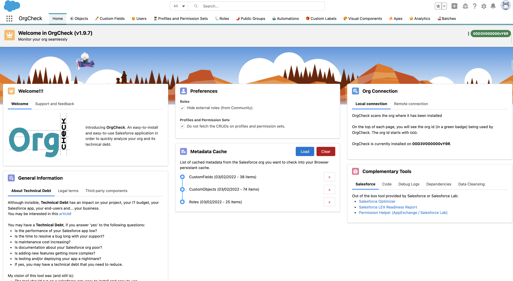

# Welcome to Org Check

Let administrators, developers, customers and partners have an application within 
their Salesforce org to monitor and help **continuously reduce their technical debt**.

## Why would you need this application in your org?

Make sure your Salesforce organisation is under control in terms of **technical debt reduction**.

You will need org Check to verify some things in your organisation like:
- Well Described Data Model
- Useful and meaningful Profiles and Permission Sets
- Efficent Role Hierarchy
- Active Users
- Useful Public Groups and Queues
- UI and Apex Componants respecting best practices
- Better Automations
- etc.

## My Vision of the application

- This application is **easy to install and easy to use**.
- It requires no additional software or platform whatsoever. 
- All you need is to install the application in your org from the AppExchange.
- No custom object will be added, no external connection, all stays in your browser and your org.
- The app is free of use: open sourced and available on the AppExchange (thanks to the great program called **Salesforce Labs** at Salesforce).
- Please use [this deck](http://sfdc.co/OrgCheck-Presentation) with your colleagues, company or customers to present the application before installing it and using it for your org.
- Keep in mind that Org Check is not a Salesforce product. It has not been officially tested or documented by Salesforce. Also Salesforce support is not available for Org Check. Support is based on open source participation and requests are managed (as we can) via GitHub at https://github.com/SalesforceLabs/OrgCheck/issues.

## Frequently Asked Question by Security

- Usually your security team will ask a lot of questions about installing a package from AppExchange.
- But we got you covered with this [Security FAQ](security)!

## How do I install this application?

 

- You install this application directly in the org you want to analyse from the AppExchange.
- Then, you navigate through the tabs in the app to discover some bad practices in the org.
- Any issues installing the application? Please, visit our ([Installation FAQ](installation)!

## How to get help and support?
- Join us on the Trailblazer Community at: [sfdc.co/OrgCheck-Community](https://sfdc.co/OrgCheck-Community)
- Join us on LinkedIn at: [@OrgCheckSFDC](https://www.linkedin.com/company/orgchecksfdc)
- Source code is available for anyone at: [sfdc.co/OrgCheck-Repository](https://www.sfdc.co/OrgCheck-Repository)
- Issues or ideas are welcome and can be logged by anyone at: [sfdc.co/OrgCheck-Backlog](https://www.sfdc.co/OrgCheck-Backlog)

## Useful references
- [Salesforce Help article mentionning Org Check as an alternative of the Salesforce Optimizer](https://help.salesforce.com/s/articleView?id=004980242&type=1)
- [Youtube Video: "Optimizer Is Sunsetting: Learn How To Use Org Check!" by Kate Lessard](https://www.youtube.com/watch?v=DwHchT_uFGQ)
- [Article on  Salesforce's Ben: "Free technical debt analysis"](https://www.salesforceben.com/salesforce-org-check-free-technical-debt-analysis)
- [Article on Pablo Gonzalez blog: "10 Salesforce Open-source Projects for DevOps Engineers"](https://www.pablogonzalez.io/top-10-salesforce-open-source-projects-for-devops/#4-orgcheck)
- [Youtube Video: "Reduce Technical Debt with Org Check"](https://www.youtube.com/watch?v=gjv6q-AR1m0)
- [Article on Medium: "How to contin uously monitor, balance, challenge, and reduce Technical Debt in a Salesforce org?"](https://medium.com/@vfinet/how-to-continuously-monitor-balance-challenge-and-reduce-technical-debt-in-a-salesforce-org-8809cef4ce4a)
- [Article on Medium:  "Five concrete actions to reduce technical debt related to Apex Classes"](https://medium.com/@vfinet/five-concret-actions-to-reduce-technical-debt-related-to-apex-classes-reduce-technical-debt-f71a31e4b30c)
- [Youtube Video: "Org Check Review by Ike Wagh"](https://www.youtube.com/watch?v=IG4zzqVsO_8)
- [Salesforce Labs Live! "How to Reduce Technical Debt from your Salesforce Environment (Ep.1)"](https://www.youtube.com/watch?v=ZCJ_NH-29I0)
- [Albanian Dreamin21: "Org Check presentation" by Sara Sali and Vincent Finet](https://dreamin21.sfalbania.al/schedule/schedule-fullwidth-filterable/)
- [Article on Unofficial SF: "Analyze your org with Org Check"](https://unofficialsf.com/from-vincent-finet-analyze-your-org-with-orgcheck/)
- [Article on Salesforce's Ben: "Free ways to monitor your Salesforce org"](https://www.salesforceben.com/free-ways-to-monitor-your-salesforce-org/)

## I am a developer, how do I contribute?

To set up a development environment and deploy Org Check as your own unlocked package, follow the steps outlined in the [Development Setup Guide](development).

Once done when you want to send a Pull Request just do so from Github and we will review it.
Please note that you will need to sign the Salesforce CLA to do this.

