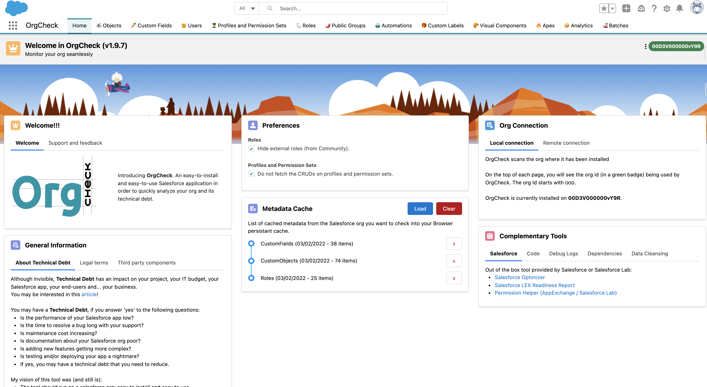

# Welcome to Org Check

Let administrators, developers, customers and partners have an application within 
their Salesforce org to monitor and help **continuously reduce their technical debt**.

**Org Check** comes into two flavours:
- a Salesforce application, including a nice UI -- suitable for regular users
- a sf CLI plugin, unix command like tool -- ideal for automation and multi-org scenario

Either way, Org Check is meant to be **easy to install and easy to use**:
- It requires no additional software or platform whatsoever. 
- If you want to use the app: you just need to install the package from the AppExchange in your org
- If you want to use the sf plugin: you just need to install the plugin from your sf CLI locally
- No custom object will be added, no external connection, all stays in your computer (browser or terminal) and your org.
- Org Check is free of use: open sourced, available on the AppExchange (thanks to the great program called **Salesforce Labs** at Salesforce) and on the NPMjs website.
- Please use [this deck](http://sfdc.co/OrgCheck-Presentation) with your colleagues, company or customers to present the application before installing it and using it for your org.
- Keep in mind that Org Check is not a Salesforce product. It has not been officially tested or documented by Salesforce. Also Salesforce support is not available for Org Check. Support is based on open source participation and requests are managed (as we can) via GitHub at (https://github.com/SalesforceLabs/OrgCheck/issues).

## Show me the app!

## Frequently Asked Question by Security

- Usually your security team will ask a lot of questions about installing a package from AppExchange.
- But we got you covered with this [Security FAQ](security)!

## How do I install the Org Check salesforce application?

 

- You install this application directly in the org you want to analyse from the AppExchange.
- Then, you navigate through the tabs in the app to discover some bad practices in the org.
- Any issues installing the application? Please, visit our [FAQ](faq)!

## How do I install the Org Check sf plugin?

Since release v8, Org Check also ships a Salesforce CLI plugin package named `@orgcheck/sfdx-plugin`.

- This plugin runs checks directly from the command line using the same API engine.
- Current commands include:
  - `sf check apex-classes`
  - `sf check hardcoded-urls`
  - `sf check global-view`
- Output can be exported as `.csv`, `.json`, or `.xlsx`.
- In production orgs, usage terms may require explicit acceptance using the command flag `--accept-the-terms`.

## How to get help and support?
- Join us on the Trailblazer Community at: [sfdc.co/OrgCheck-Community](https://sfdc.co/OrgCheck-Community)
- Join us on LinkedIn at: [@OrgCheckSFDC](https://www.linkedin.com/company/orgchecksfdc)
- Source code is available for anyone at: [sfdc.co/OrgCheck-Repository](https://www.sfdc.co/OrgCheck-Repository)
- Issues or ideas are welcome and can be logged by anyone at: [sfdc.co/OrgCheck-Backlog](https://www.sfdc.co/OrgCheck-Backlog)

## Useful references
- [Salesforce Help article mentioning Org Check as an alternative to Salesforce Optimizer](https://help.salesforce.com/s/articleView?id=004980242&type=1)
- [Youtube Video: "Optimizer Is Sunsetting: Learn How To Use Org Check!" by Kate Lessard](https://www.youtube.com/watch?v=DwHchT_uFGQ)
- [Article on  Salesforce's Ben: "Free technical debt analysis"](https://www.salesforceben.com/salesforce-org-check-free-technical-debt-analysis)
- [Article on Pablo Gonzalez blog: "10 Salesforce Open-source Projects for DevOps Engineers"](https://www.pablogonzalez.io/top-10-salesforce-open-source-projects-for-devops/#4-orgcheck)
- [Youtube Video: "Reduce Technical Debt with Org Check"](https://www.youtube.com/watch?v=gjv6q-AR1m0)
- [Article on Medium: "How to contin uously monitor, balance, challenge, and reduce Technical Debt in a Salesforce org?"](https://medium.com/@vfinet/how-to-continuously-monitor-balance-challenge-and-reduce-technical-debt-in-a-salesforce-org-8809cef4ce4a)
- [Article on Medium:  "Five concrete actions to reduce technical debt related to Apex Classes"](https://medium.com/@vfinet/five-concret-actions-to-reduce-technical-debt-related-to-apex-classes-reduce-technical-debt-f71a31e4b30c)
- [Youtube Video: "Org Check Review by Ike Wagh"](https://www.youtube.com/watch?v=IG4zzqVsO_8)
- [Salesforce Labs Live! "How to Reduce Technical Debt from your Salesforce Environment (Ep.1)"](https://www.youtube.com/watch?v=ZCJ_NH-29I0)
- [Albanian Dreamin21: "Org Check presentation" by Sara Sali and Vincent Finet](https://dreamin21.sfalbania.al/schedule/schedule-fullwidth-filterable/)
- [Article on Unofficial SF: "Analyze your org with Org Check"](https://unofficialsf.com/from-vincent-finet-analyze-your-org-with-orgcheck/)
- [Article on Salesforce's Ben: "Free ways to monitor your Salesforce org"](https://www.salesforceben.com/free-ways-to-monitor-your-salesforce-org/)

## I am a developer, how do I contribute?

To set up a development environment and deploy Org Check as your own unlocked package, follow the steps outlined in the [Development Setup Guide](development).

Once done when you want to send a Pull Request just do so from Github and we will review it.
Please note that you will need to sign the Salesforce CLA to do this.

