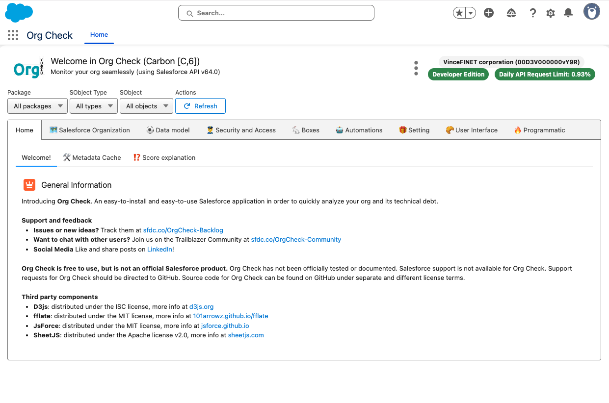

# Welcome to Org Check

Let administrators, developers, customers and partners have an application within 
their Salesforce org to monitor and help **continuously reduce their technical debt**.

## Why would you need this application in your org?

Make sure your Salesforce organisation is under control in terms of **technical debt reduction**.

You will need org Check to verify some things in your organisation like:
- Well Described Data Model
- Useful and meaningful Profiles and Permission Sets
- Efficent Role Hierarchy
- Active Users
- Useful Public Groups and Queues
- UI and Apex Componants respecting best practices
- Better Automations
- etc.

## My Vision of the application

This application is **easy to install and easy to use**.
It requires no additional software or platform whatsoever. 
All you need is to install the application in your org from the AppExchange.
No custom object will be added, no external connection, all stays in your browser and your org.
The app is free of use: open sourced, available on the AppExchange for free and a support on slack and GitHub.

Please use [this deck](http://sfdc.co/OrgCheck-Presentation) with your colleagues, company or customers to present the application before installing it and using it for your org.

Keep in mind that Org Check is not a Salesforce product. It has not been officially tested or documented by Salesforce. Also Salesforce support is not available for Org Check. Support is based on open source participation and requests are managed (as we can) via GitHub at https://github.com/VinceFINET/OrgCheck/issues.

## How do I install this application?

You install this application directly in the org you want to analyse from the AppExchange.

Then, you navigate through the tabs in the app to discover some bad practices in the org.

 

Any issues installing the application? Please, [go to this dedicated page](installation) about installation, including some frequently asked questions.

## How to get help and support?

- Source code is available to anyone at: https://www.sfdc.co/OrgCheck-Repository
- Issues or ideas are welcome and can be logged by anyone at: https://www.sfdc.co/OrgCheck-Backlog
- Join our public Slack workspace at: https://sfdc.co/OrgCheck-Community

