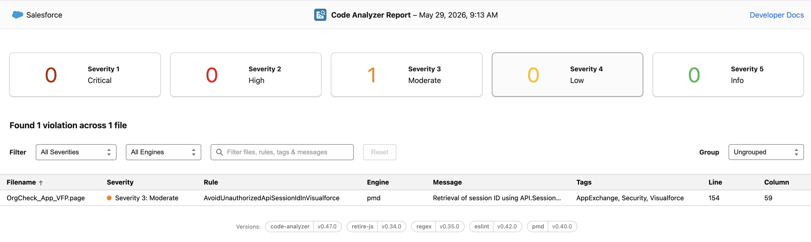
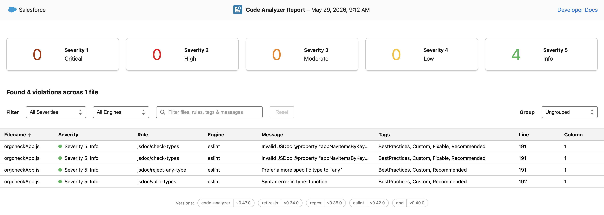
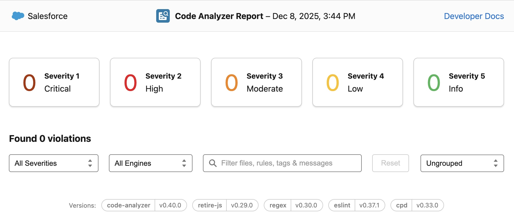
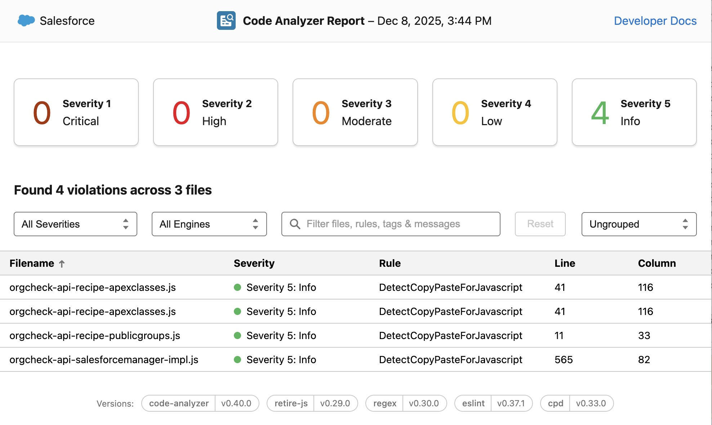
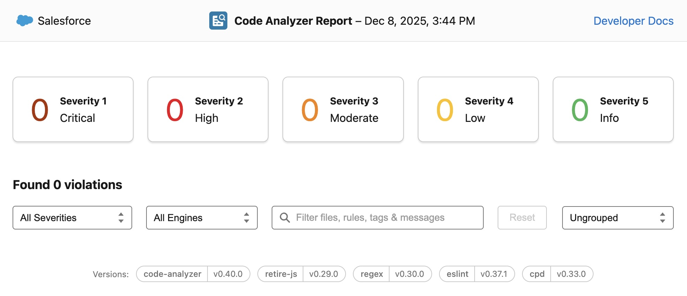

# Code scan reports

These are the results of the code scan of the last version of Org Check done on **29 May 2026** as part of the AppExchange security review that Org Check passed successfully in May 2026.

Two scans were run:

## Security Review policy scan (29 May 2026):

## LWC components code scan (29 May 2026):

---

## Previous scan results (08 December 2025)

These were the results of the previous code scan, split by module, run on 08 December 2025:

### UI module code scan (08 December 2025):

### API module code scan (08 December 2025):

### LWC module code scan (08 December 2025):

