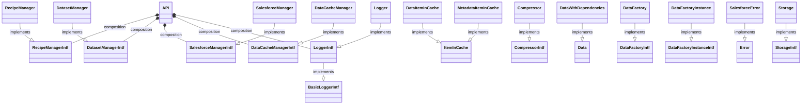
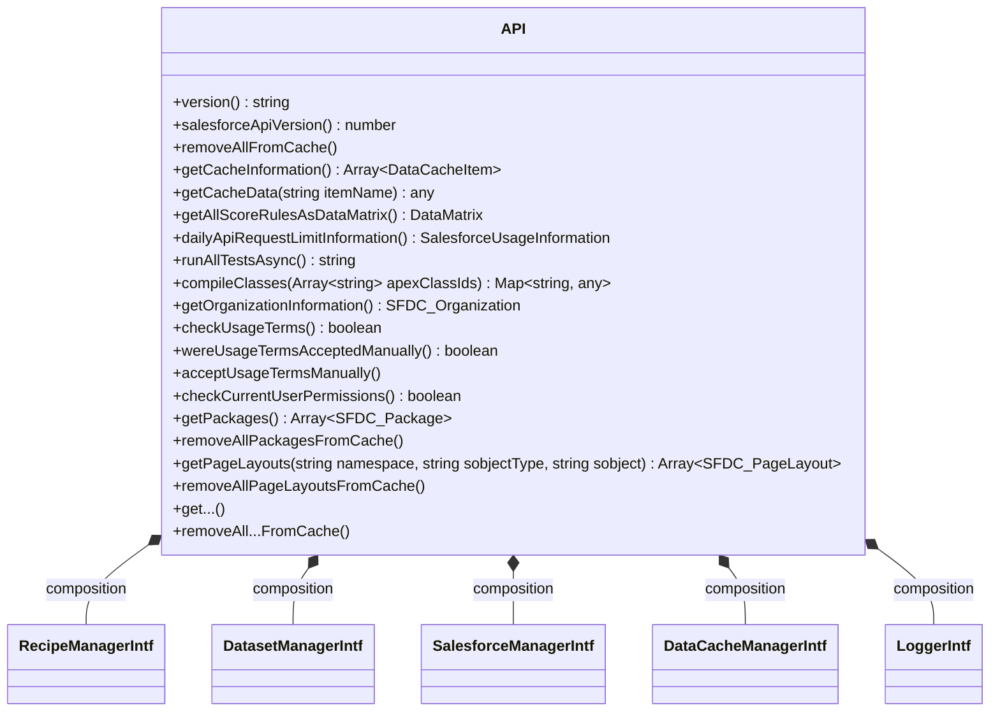
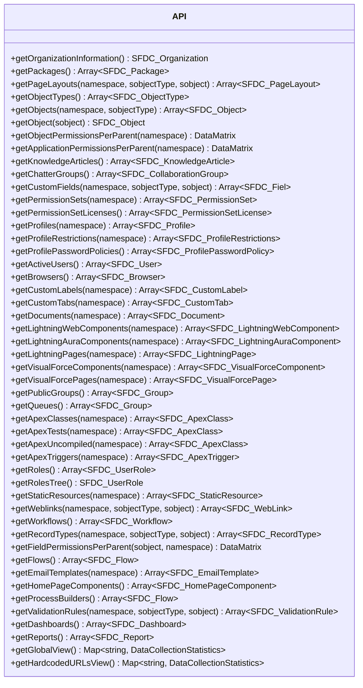

# Org Check classes and diagrams

## Overview



## Starting point: the API class!

The starting point in the Org Check api is the `API` class (how original!) located in the 
file build/src/api/orgcheck-api.js

### Diagram of the API class



### Creation of an instance of the API class

To create an instance of the Org Check API you would do:
```
const api = new API({
    salesforce: {
        authentication: { accessToken: '........' },
        connection: { useJsForce: true }
    },
    storage: { 
        localImpl: this.localStorage,
        compression: { useFflate: true },
        encoding: { useFflate: true }
    },
    logSettings: {
        isConsoleFallback: () => { return true; },
        log: (section, message) => { ... },
        ended: (section, message) => { ... },
        failed: (section, error) => { ... }
    }
});
```

At this point we get only an access token to connect to a Salesforce org. We are actively working 
on implementing the authentication with a connected app/external app approach.

The api will store as much as it can in a local storage. As of now the implementation that is used 
is the one from the browser. Using the third party fflate help us reducing the size of the data 
being stored. Note: it does not encrypt the data!

Finally, the api will use a set of methods to notify the user about how is the process going. 

Once initialiazed, and before processing further, you should check if the terms of conditions are 
auto-approved (non production environment) or need to be approved manually (production environment) 
by calling api.checkUsageTerms(). If the method returns false, you will have to specifically accept 
the term by calling api.acceptUsageTermsManually().

### Retrieve data from the org via the API class

Multiple methods are accessible to retrieve data from the org that is scored by Org Check. 
This data is a result of the Recipe process discussed later.
All these methods are `async`.



## Recipes

A `Recipe` can be defined as a data transformer that needs some input data (from `Dataset`) and then 
transform the data all together into a complexe structure.

Most of the time, the recipe combines multiple objects that are related to each other, like a `User` 
and its `Profile`.

The `Recipe` is not the place to calculate or modify the score of the data, this is done at the 
`Dataset` level.


## Datasets

A `Dataset` can be defined as a data retriever.

Most of the time, the dataset will use the salesforce manager to read information from the org (SOQL, 
SOSL, Tooling, Describe, etc.) and then will map that data into the corresponding `SFDC_*` object.

Data factories are used to create the `SFDC_*` objects and also to compute the objects' scores.

Scores are calculated based on the `SecretSauce` class.

