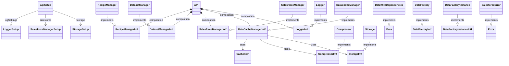
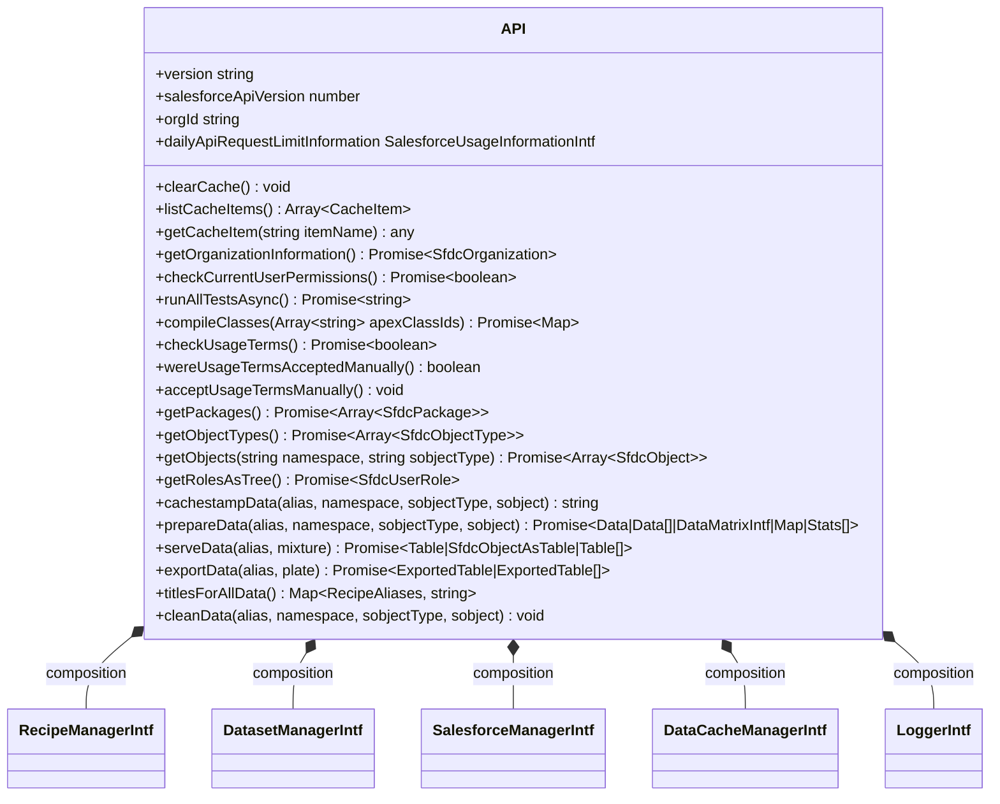
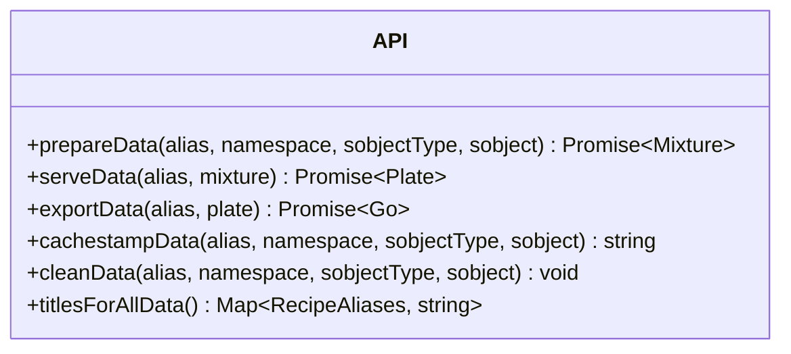

# Org Check classes and diagrams

## Overview


```mermaid
classDiagram
ApiSetup --> LoggerSetup : logSettings
ApiSetup --> SalesforceManagerSetup : salesforce
ApiSetup --> StorageSetup : storage

API *-- RecipeManagerIntf : composition
API *-- DatasetManagerIntf : composition
API *-- SalesforceManagerIntf : composition
API *-- DataCacheManagerIntf : composition
API *-- LoggerIntf : composition

Logger --|> LoggerIntf : implements
SalesforceManager --|> SalesforceManagerIntf : implements
DatasetManager --|> DatasetManagerIntf : implements
RecipeManager --|> RecipeManagerIntf : implements

DataCacheManager --|> DataCacheManagerIntf : implements
DataCacheManagerIntf --> CacheItem : uses
Compressor --|> CompressorIntf : implements
Storage --|> StorageIntf : implements
DataCacheManagerIntf --> CompressorIntf : uses
DataCacheManagerIntf --> StorageIntf : uses

DataWithDependencies --|> Data : implements
DataFactory --|> DataFactoryIntf : implements
DataFactoryInstance --|> DataFactoryInstanceIntf : implements
SalesforceError --|> Error : implements
```

## Starting point: the API class!

The starting point in the Org Check API is the `API` class (in `packages/orgcheck-api/src/api/orgcheck-api-impl.ts`), 
built and exported as `packages/orgcheck-api/dist/orgcheck.js`.

### Diagram of the API class


```mermaid
classDiagram
    class API {
        +version string
        +salesforceApiVersion number
        +orgId string
        +clearCache() void
        +listCacheItems() Array~CacheItem~
        +getCacheItem(string itemName) any
        +dailyApiRequestLimitInformation SalesforceUsageInformationIntf
        +getOrganizationInformation() Promise~SfdcOrganization~
        +checkCurrentUserPermissions() Promise~boolean~
        +runAllTestsAsync() Promise~string~
        +compileClasses(Array~string~ apexClassIds) Promise~Map~
        +checkUsageTerms() Promise~boolean~
        +wereUsageTermsAcceptedManually() boolean
        +acceptUsageTermsManually() void
        +getPackages() Promise~Array~SfdcPackage~~
        +getObjectTypes() Promise~Array~SfdcObjectType~~
        +getObjects(string namespace, string sobjectType) Promise~Array~SfdcObject~~
        +getRolesAsTree() Promise~SfdcUserRole~
        +cachestampData(alias, namespace, sobjectType, sobject) string
        +prepareData(alias, namespace, sobjectType, sobject) Promise~Data|Data[]|DataMatrixIntf|Map|Stats[]~
        +serveData(alias, mixture) Promise~Table|SfdcObjectAsTable|Table[]~
        +exportData(alias, plate) Promise~ExportedTable|ExportedTable[]~
        +titlesForAllData() Map~RecipeAliases, string~
        +cleanData(alias, namespace, sobjectType, sobject) void
    }

API *-- RecipeManagerIntf : composition
API *-- DatasetManagerIntf : composition
API *-- SalesforceManagerIntf : composition
API *-- DataCacheManagerIntf : composition
API *-- LoggerIntf : composition
```

### Creation of an instance of the API class

To create an instance of the Org Check API you would do:
```
const api = ApiFactory.create({
    salesforce: {
        authenticationOptions: { accessToken: '........' },
        connection: connection  // optional: jsforce Connection instance
    },
    storage: { 
        setItem: (key, value) => { ... },
        getItem: (key) => { ... },
        removeItem: (key) => { ... },
        key: (n) => { ... },
        length: () => { ... }
    },
    logSettings: {
        started: (operationName) => { ... },
        messageLogged: (operationName, message) => { ... },
        endedWithError: (operationName, error) => { ... },
        endedSuccessfully: (operationName, message) => { ... },
        stopped: (operationName) => { ... }
    }
});
```

The `salesforce` setup accepts either `authenticationOptions` (with `accessToken`) or a `connection` 
(jsforce Connection instance) to connect to a Salesforce org.

The `storage` setup provides key-value persistence with `setItem`, `getItem`, `removeItem`, `key`, and 
`length`. The browser app uses `localStorage`; the fflate library is used for compression when storing 
data. Note: it does not encrypt the data!

The `logSettings` setup provides callbacks for progress tracking: `started`, `messageLogged`, 
`endedWithError`, `endedSuccessfully`, and `stopped`. 

Once initialized, and before processing further, you should check if the terms and conditions are 
auto-approved (non production environment) or need to be approved manually (production environment) 
by calling api.checkUsageTerms(). If the method returns false, you will have to specifically accept 
the term by calling api.acceptUsageTermsManually().

### Retrieve data from the org via the API class

The current API exposes a generic data pipeline. You choose a `RecipeAliases` value, then:
- use `prepareData(...)` to load and score data,
- use `serveData(...)` to format data as UI tables,
- use `exportData(...)` to format export payloads.

Most retrieval/processing methods are `async`.


```mermaid
classDiagram
    class API {
        +prepareData(alias, namespace, sobjectType, sobject) Promise~Mixture~
        +serveData(alias, mixture) Promise~Plate~
        +exportData(alias, plate) Promise~Go~
        +cachestampData(alias, namespace, sobjectType, sobject) string
        +cleanData(alias, namespace, sobjectType, sobject) void
        +titlesForAllData() Map~RecipeAliases, string~
    }
```

## Recipes

A `Recipe` can be defined as a data transformer that needs some input data (from `Dataset`) and then 
transform the data all together into a complex structure.

Most of the time, the recipe combines multiple objects that are related to each other, like a `User` 
and its `Profile`.

The `Recipe` is not the place to calculate or modify the score of the data, this is done at the 
`Dataset` level.


## Datasets

A `Dataset` can be defined as a data retriever.

Most of the time, the dataset will use the salesforce manager to read information from the org (SOQL, 
SOSL, Tooling, Describe, etc.) and then will map that data into the corresponding `Sfdc*` object.

Data factories are used to create the `Sfdc*` objects and also to compute the objects' scores.

Scores are calculated based on the `SecretSauce` class.

