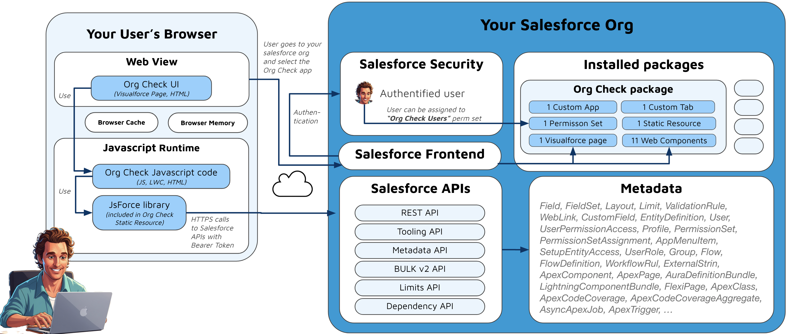

# Frequently Asked Question by Security

## What data is stored in Org Check?

- At this point of time, the Org Check application is only analyzing configuration data in the Salesforce org where it is installed.
- We usually call this data as “metadata” such as list of Apex Classes, SObjects definition, Custom fields, etc. 
- We do not collect your data such as Account, Contact, Opportunity or any custom object you may have created in your org.
- The metadata types that are gathered (as of August 2025) by the application using Salesforce APIs from the org where the app is installed are:
  * Home: InstalledSubscriberPackage, Organization
  * ⚽ Data model: Field, FieldSet, Layout, Limit, ValidationRule, WebLink, CustomField, EntityDefinition
  * 👮 Security and Access: User, UserPermissionAccess, Profile, PermissionSet, PermissionSetAssignment, AppMenuItem, SetupEntityAccess
  * 🐇 Boxes: UserRole, Group
  * 🤖 Automations: Flow, FlowDefinition, WorkflowRule
  * 🎁 Setting: ExternalString
  * 🥐 User Interface: ApexComponent, ApexPage, AuraDefinitionBundle, LightningComponentBundle, FlexiPage
  * 🔥 Programmatic: ApexClass, ApexCodeCoverage, ApexCodeCoverageAggregate, AsyncApexJob, ApexTrigger

## Is the data processed outside of my region or Country?

- The metadata (and not the data) is gathered from the user’s browser using Javascript library that is nested in the Org Check application, and then processed by the user’s browser and potentially cached in the same browser.
- No external storage is used, not even a custom object in the org.
- If the metadata is processed outside of your region or country it is because the user you gave access to your org and the app comes from another region or country.

## What are the flow in Org Check (data processing) ? Can you share a flow / Architecture diagram ?

- Org Check is using a Javascript library called “JSForce” (v1.11.1) to connect to the local Salesforce org where it is installed. Note that this library is also used by Salesforce for its own SF CLI plugin technology.
- This library is part of the package so there is no dependencies with other external site that may host this library. Once the application is installed in your org, the library is hosted in your org.
- Then Org Check uses the following standard Salesforce APIs (limited to the org where it is installed) via the JSForce library:
  * REST API
  * Tooling API
  * Metadata API
  * BULK v2 API
  * Limits API
  * Dependency API
- To perform these calls the current user is used during the navigation in the application.
- The application is expecting the current user to have the following system permissions, if not the application will stop and show a warning message:
  * ModifyAllData
  * AuthorApex
  * ApiEnabled
  * InstallPackaging
- So basically the flows are rather the same from on tab to the other:
  * get a list of metadata from the Salesforce org using the appropriate Salesforce API
  * if the data is cached and not to “old” then use it (to avoid impacting the Request API limit)
  * compute on the fly the aggregated data that is needed in the tab. The process is within the Javascript code in the user’s browser. Important: we do not alter the org metadata nor data at this point or any point at all.
  * our secret sauce is to compute a score based on best practices and the data will be sorted so that we show the configuration that needs to be “corrected”.
- Export feature is available in some tabs. This uses a library called “SheetJS” also part of the package. That data is not leaving your org or your browser. The Excel file is generated by Javascript on your browser and once finished available in your Download folder of your browser.

## How org check is impacting my own org ? API Limits, Objects, Apex,...

- The usage of this application impacts only one limit in your salesforce org which is called '“Daily API Request limit”.
- All calls to the Salesforce APIs on your org by the application is preceded with a check if that Daily API Request limit has reached a certain percentage.
- From 0% to 70%, the application will call the API.
- When the limit reaches 70% up to 90%, the application will call the API but will also show a warning to the user.
- This warning is not STOPPING the application from calling the API.
- Then if the limit reaches 90%, the application will refuse to call anymore APIs and will show an error. If this type of error happens, just wait for the limit to decrease (as this is a 24 hour rolling limit). Or use the app in another sandbox for a specific usage.
- IMPORTANT: We encourage you to use Org Check in a sandbox that is not crucial for your dev lifecycle and certainly not your production org. Even if we put in place this check, we remind you that Salesforce Labs applications like Org Check have no warranty of any sort (as described in the AppExchange).

## Is Org Check Open Source ? Can We customize Org Check or participate to Org Check Development ? if yes, how do you select your team members ?

- Org Check is open source.
- The code is available on GitHub: https://github.com/SalesforceLabs/OrgCheck
- Under the MIT license: https://github.com/SalesforceLabs/OrgCheck?tab=MIT-1-ov-file#readme
- If you install the application fro AppExchange, the code is locked because the store forces us to use a “managed package”. So in short you won’t be able to change the code directly from the Salesforce org where it is installed.
- Same if you installed the application for the “unlocked package” that allows you to install the application in a sandbox without having the right to install apps in production (which is the case when you install application from AppExchange).
- As the code is open source, you are free to fork the project, and make your own modifications to it. In this case, we believe that it would be great to share your modifications to the community by doing Pull Request to the main project. To do so you will need to sign a digital agreement (this is because our repository is hosted in the Salesforce Labs project owned by Salesforce). This is own team members can contribute to the project even thought they are not part of Salesforce.
- Of course before considering doing your own fork of the project, you could just create an issue in the main project and we will be happy to work with you on a fix or an a new feature you will want in future releases.

## What are the security check-in related to Org Check ? past, current and future ?

- The Org Check application has been validated by a Security Review from the ISV Salesforce internal team.
- That team is validating ALL applications that are hosted in the AppExchange. 
- By “ALL” we mean salesforce labs or not, free or not, etc...
- We got our validation back in September 2022:
